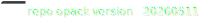

# nAttrMon



## Documentation

Please check the [nattrmon-docs](https://openaf.github.io/nattrmon-docs/) for more info.

## How to install nattrmon.opack

Just execute:
````bash
opack install nattrmon
````
or, for a specific version:

````bash
opack install nattrmon-yyyyMMdd.opack
````

Where nattrmon-yyyyMMdd.opack is the package provided.

## How to update an existing nAttrMon

1. Backup your config/inputs, config/outputs and config/validations folders:

````bash
cd /the/folder/where/nAttrMon/is/installed
ojob .\util\backupConfig.yaml
````

This will generate a file called nattrmonConfig-yyyyMMdd.zip. Do move it to another folder (e.g. your home folder, for example)

2. Execute the update:
````bash
opack update nattrmon
````

Do keep in mind that newer versions might require updated OpenAF versions also.
_NOTE: If you experience any error you can use the install procedure._

If you use the default config folder the update is done. If you use a different config keep in mind the following considerations:

* The inputs.disabled, outputs.disabled and validations.disabled examples might have changed. You will still find them under the default config folder.
* If your config folder has objects and objects.assets copied from the default config/objects folder we strongly recommend that you merge all of them or use COREOBJECTS setting on the main nattrmon.yaml configuration file.
* As a last resort you have the backup copied created on step 1 so you can recreate your config folder using the updated default config folder.

## How to create a standalone nattrmon.opack

1. Clone this repository https://github.com/OpenAF/nAttrMon.git
2. With openaf installed execute `opack pack .`
3. It should generate a package nattrmon-yyyyMMdd.opack.
