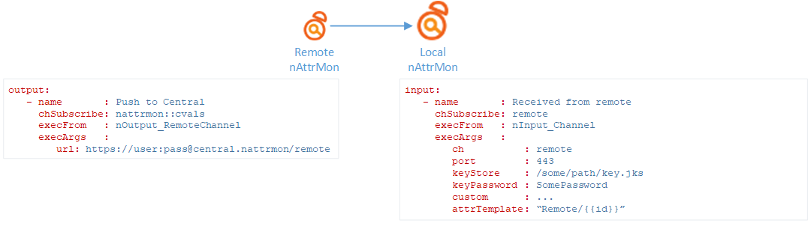
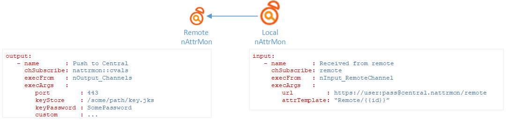

# Interconnect nAttrMon's instances 

Althought nAttrMon can be operated in an "agent-less" mode (for most of the inputs) on installed directly or directly on a single server it's possible also to operate it on a "agent" mode where nAttrMon instances are deploy across several servers with output plugs to send the attribute values to other nAttrMon instances.

Attribute values can be either pushed from a nAttrMon instance to another or retrieved. The decision between the two should be analyzed for each case.

*Note: althought it's possible for warnings to be pushed/retrieved from other nAttrMon instances you should implement local validations of "remote" attributes or convert the warnings into attribute values (e.g. x high alarms, y medium alarms, etc...)*

## Remote instance pushing attributes to another nAttrMon instance

To have a remote instance "push" attribute values to a local nAttrMon instance you can use a nOutput_RemoteChannel on the remote instance and a nInput_Channel on the local nAttrmon.

## Retriving attributes from a remote nAttrMon instance

To have the local nAttrMon retrieve attribute values from a remote instance you can use a nOutput_Channels on the remote instance and a nInput_RemoteChannel on the local nAttrMon.

*Note: To increase security of the communication between two instances use a security key store (e.g. SSL certificate) and a strong custom authentication including two-factor authentication.*
